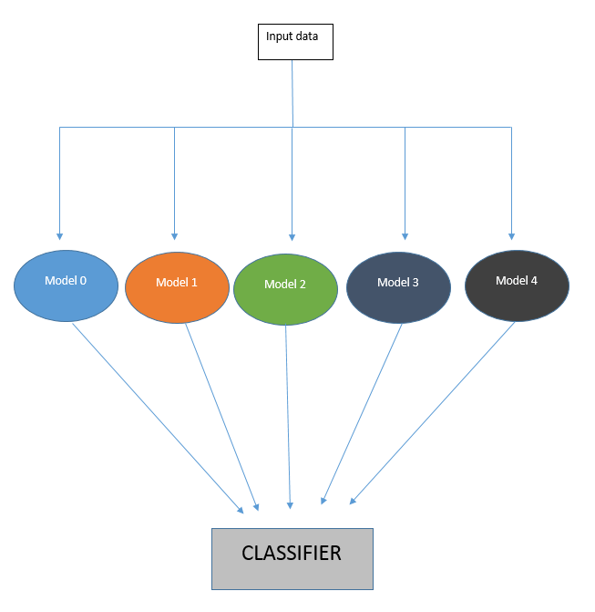

# Tutorial about 3D convolutional network

For me, Artificial Intelligence is like a passion and I am trying to use it to solve some daily life problems. In this tutorial/project, I want to give some intuitions to the readers about how 3D convolutional neural networks are actually working. There are not a lot of tutorial about 3D convolutional neural networks, and not of a lot of them investigate the logic behind these networks.

## "Standard" convolutional network

Before to dive into 3D CNN, let's summarize together what we know about ConvNets. ConvNets consists mainly in 2 parts:
    
* The feature extractor: this part of the network takes as input the image and extract the features that are meaningful for its classification. It amplifies aspects of the input that is important for discrimination and suppresses irrelevant variations. Usually, the feature extractor consists of several layers.    For instance, an image which could be seen as an array of pixel values. The first layer often learns representations that represent the presence or absence of edges at particular orientations and locations in the image. The second layer typically detects motifs by spotting particular arrangements of edges, regardless of small variations in the edge positions. Finally the third layer may assemble motifs into larger combinations that correspond to parts of familiar objects, and subsequent layers would detect objects as combinations of these parts. 


* The classifier: this part of the network takes as input the previously computed features and use them to predict the correct label.
    

    
In order to extract such features, ConvNets use 2D convolution operations. 


## Why do we need a 3D CNN?

Traditionally, ConvNets are targeting RGB images (3 channels). The goal of 3D CNN is to take as input a video and extract features from it. When ConvNets extract the graphical characteristics of a single image and put them in a vector (a low-level representation), 3D CNNs extract the graphical characteristics of a **set** of images. 3D CNNs takes in to account a temporal dimension (the order of the images in the video). From a set of images, 3D CNNs find a low-level representation of a set of images, and this representation is useful to find the right label of the video (a given action is performed)

In order to extract such features, 3D convolution uses 3Dconvolution operations. 


## Is 3D CNN the only solution to video classification?

There are several existing approaches to tackle the video classification. This is a nonexaustive list of existing approaches:

* ConvNets + LSTM cell: Extract features from each frame with a ConvNet, passing the sequence to an RNN, in a separate network
[paper](https://arxiv.org/abs/1411.4389), [Tutorial on Keras ](https://machinelearningmastery.com/cnn-long-short-term-memory-networks/)

* Temporal Relation Networks: Extract features from each frame with a ConvNet and pass the sequence to an MLP [paper](https://arxiv.org/pdf/1711.08496.pdf) [Github](https://github.com/metalbubble/TRN-pytorch)

* Two-Stream Convolutional Networks: Use 2 CNN, 1 spatial stream ConvNet which process one single frame at a time, and 1 Temporal stream ConvNet which process multi-frame optical flow [paper](http://papers.nips.cc/paper/5353-two-stream-convolutional-networks-for-action-recognition-in-videos.pdf) [Github](https://github.com/wushidonguc/two-stream-action-recognition-keras)

## What is the main drawback of 3D CNN?

From my point of view, there are two main drawbacks compared to the other methods:

* We don't take advantage of previously trained 2D networks (Inception Net, Resnet ...) to extract the video features. This problem is not as important as before recently because several strong 3D CNNs have been build using similar design pattern as the 2D version ([paper](https://arxiv.org/abs/1711.09577)).

* The memory: 3D CNNs often use more GPU memory as the traditional 2D CNN. This problem is not as important as before because GPUs tend to have more and more memory.

## The dataset

For this tutorial, we will use the [20BN-jester Dataset V1](https://20bn.com/datasets/jester). The 20BN-JESTER dataset is a large collection of densely-labeled video clips that show humans performing pre-defined hand gestures in front of a laptop camera or webcam. You can download it on their website.

After downloading all parts, extract using:

cat 20bn-jester-v1-?? | tar zx

Before to start implementing any network, I advise you to take a quick look of the video (set of images). It is essential that you understand what you need to predict.

## The network

As for traditional 2D ConvNet, we net use a set of convolution, max pooling operations to reduce layer after layer the size the of our input data. In this tutorial, the shape of our input is [number of training example in a batch, number of channels, number of images in the video, the height, the width]

The goal is to reduce slowly the graphical dimension (the height and the width) and the temporal dimension (number of images in the video) until you get a vector of dimension [number of training example in a batch, number of channel, 1, 1, 1]. After that, you send this vector to a multi-layers classifier.

## Overfitting

In order to reduce the overfitting, I used 3 techniques:

* Data augmentation: we augment the amount of training data via random affine transformation (RandomAffine(degrees=[-10, 10], translate=[0.15, 0.15]))
* Dropout: the idea of this technique, basically we want to trade training performance for more generalization. Basically, during training, some fractions of the neurons on a particular layer will be randomly deactivated. This improves generalization because force your layer to learn with different neurons the same "concept".
* Batch normalization: this technique performs feature scaling and improves gradient flow. It often plays a small in the regularization.
    
## Optimizer

In this tutorial, we use the Adam optimizer with the AMSGRAD optimization described in this [paper](https://openreview.net/pdf?id=ryQu7f-RZ). Empirically, it tends to improve the convergence of my model. However, the reader should keep in mind that other experiences (from other users) have shown that the AMSGRAD optimization could also lead to worse performance than ADAM.

## Vizualization tool

For visualizing the result, I like to use tensorboard. Since tensorboard is not available by default on Pytorch, I used tensorboardX which enable Pytorch to use tensorboard.

## How to run this code?

First, you have to set up the config file accordingly (define the right path, the name of your model ...). After you just need to run:

```python train.py --config configs/config.json -g 0```

For the prediction, run:

```python train.py --eval_only True --resume True --config configs/config.json -g 0```

-g: the ID of the GPU you are using. If you are using multiple GPU, you can write:

```python train.py --config configs/config.json -g 0,1```

Note: this code works well for python 3.6 and with pytorch 0.4.

## Results

For this network, I got an accuracy of 85% for the validation set. Since there is an accuracy gap between the training set and the validation set, there is plenty of room for improvements.

Below you can find the training curves obtained via tensorboard.

### Training

  

### Validation

  

## Better accuracy

An accuracy of 85% on the validation is nice. However, can we do better? 

First, we can observe that the accuracy on the training set is closed to 100%, but the accuracy on the validation set plateau at 85%. There is a difference of 15%, which can be explained by the fact that our model tends to overfit our training dataset. What can you do against that? 

Several things can be done:
* Go deeper: however when you go deeper, you meet the [Vanishing gradient problem](https://en.wikipedia.org/wiki/Vanishing_gradient_problem). If you went to go deeper, I strongly advise you a more advanced 3D CNN architecture such as this [work](https://github.com/kenshohara/3D-ResNets-PyTorch)
* Add more data: Adding more data is always good for the generalization. In our situation, we work with a fixed size dataset. Augmenting the size of our dataset requires data augmentation technique.
* Combining several predictors to improve the overall prediction. This approach is called Ensemble learning.

## Ensemble learning

Let's take a simple example. We have 3 binary classifiers (A,B,C) with a 70% accuracy. A,B,C can be based on 3D convolution architecture as mentioned previously. 

For a majority vote with 3 members we can expect 4 outcomes:

All three are correct
  0.7 * 0.7 * 0.7
= 0.3429

Two are correct
  0.7 * 0.7 * 0.3
+ 0.7 * 0.3 * 0.7
+ 0.3 * 0.7 * 0.7
= 0.4409

Two are wrong
  0.3 * 0.3 * 0.7
+ 0.3 * 0.7 * 0.3
+ 0.7 * 0.3 * 0.3
= 0.189

All three are wrong
  0.3 * 0.3 * 0.3
= 0.027

We see that most of the times (~44%) the majority vote corrects an error. This majority vote ensemble will be correct an average of ~78% (0.3429 + 0.4409 = 0.7838).

## Stacking and 3D CNN

In this implementation, we train first 5 3D CNN separately. Each of them has an accuracy of ~84-85% on the validation set. Then, we combine the predictions in order to increase the overall prediction accuracy.



And we obtain an accuracy of 88.16% on the validation set.

## Important remark

Code based off this [GulpIO-benchmarks](https://github.com/TwentyBN/GulpIO-benchmarks) implementation.

If you like you like this project, feel free to leave a star. (it is my only reward ^^)

 

